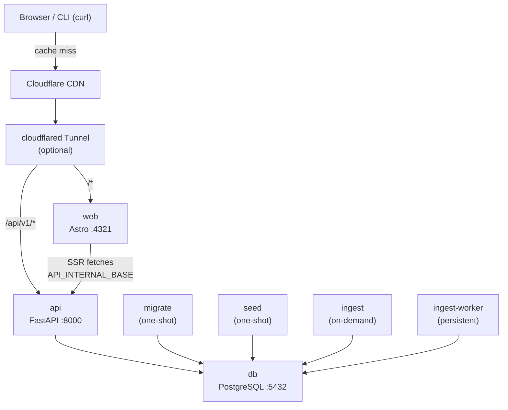

# LPS — Linux Package Search

[](LICENSE)
[](https://lps.eduluma.org)
[](https://github.com/eduluma/lps/releases)

A brew.sh-style search experience for Linux packages across distributions.
One query → one working install command, with details a click away.

**Try it:** <https://lps.eduluma.org>

```bash
# Install the CLI
curl -sSfL https://lps.eduluma.org/install.sh | sh

lps search lazygit
lps install lazygit
```

See [PRD.md](./PRD.md) for the full design.

## Services



## Monorepo layout

```text
lps/
├── api/                # FastAPI + asyncpg (Dockerfile included)
├── ingest/             # Python workers — per-distro parsers (Dockerfile included)
├── web/                # Astro + Tailwind frontend (Dockerfile included)
├── db/                 # SQL migrations + seeds
├── deploy/             # Helm chart + deployment docs
├── docker-compose.yml  # Primary local dev platform
├── Taskfile.yaml
├── PRD.md
├── NAMING.md
└── README.md
```

We start as a single git repo and split into separate repos only when team/CI pressure demands it.

## Quick start (local dev)

Requires [Task](https://taskfile.dev), [uv](https://docs.astral.sh/uv/), pnpm, and Docker Desktop.

```bash
task install               # uv sync + pnpm install
task dev                   # postgres + api + web + cloudflared via docker compose
task migrate               # apply migrations
task seed                  # seed distros + releases
task ingest -- debian bookworm
```

Then open <http://localhost:4321> (Astro) and <http://localhost:8000/docs> (FastAPI).

## Domain plan

- Production: `lps.eduluma.org` (web), `lpsapi.eduluma.org` (API)
- Routed via **Cloudflare Tunnel** → home server → Docker Desktop Kubernetes
- See [deploy/README.md](./deploy/README.md)

## Stack

Astro + Tailwind · FastAPI (asyncpg, uvloop) · PostgreSQL 16 · Cloudflare Tunnel · Helm on Docker Desktop k8s.

## verify app

```bash
# Health check
curl http://localhost:8000/healthz

# List distros (should return [] since DB is empty)
curl http://localhost:8000/api/v1/distros

# Search packages
curl "http://localhost:8000/api/v1/search?q=curl"

# Search by name
curl "http://localhost:8000/api/v1/search?q=curl"

# Filter by distro
curl "http://localhost:8000/api/v1/search?q=curl&distro=debian"

# Get a specific package detail
curl "http://localhost:8000/api/v1/packages/debian/bookworm/curl"

# List packages with filter
curl "http://localhost:8000/api/v1/packages?distro=debian&release=bookworm&q=git"
```

## seeding

docker compose run --rm ingest alpine edge
docker compose run --rm ingest alpine 3.21
docker compose run --rm ingest arch rolling
docker compose run --rm ingest fedora 41
docker compose run --rm ingest opensuse 15.6
docker compose run --rm ingest opensuse tumbleweed
